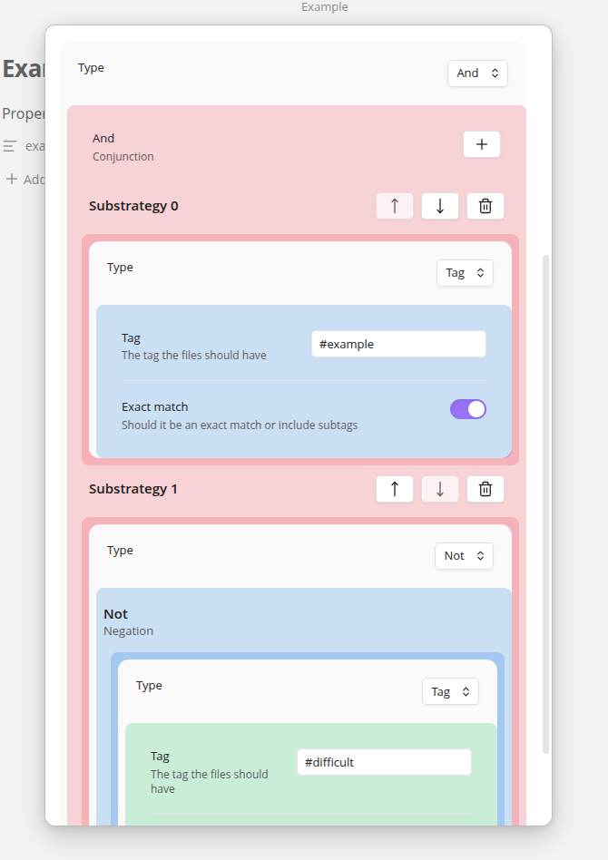

# Property Suggester Enhanced
Autocomplete Properties Enhanced improves the native obsidian suggester for frontmatter properties 
with a custom 'strategy builder'. Define custom rules for what values a property may take.
Additionally apply custom icons to properties.



## Strategy Builder
With the strategy builder you can build complex queries to select which values a property may contain.
The following strategy types are defined:
* **Tag**: Match all files that include the tag.
* **List**: Define a list of values with custom color options
* **Folder**: Match all files in a folder
* **Negation (Not)**: Invert the nested strategy
* **Conjunction (And)**: Include only options that match all nested strategies
* **Disjunction (Or)**: A union of the nested strategies
* **Code**: Execute user scripts, needs to be enabled in plugin settings.

### Code
You can write custom scripts which returns options. It should return an array of `TFile`, `string` or `{label:string, value:string}` 
The script will be wrapped in an async function. The signature is as follows:

```typescript
declare type SuggestionValue = string | TFile | {value : string, label: string, color? : HexString}
declare async function fun(app : App, ctx : Context) : SuggestionValue[]
```

### Limitations
In order for a strategy to be valid it needs to be able to produce some value. 
Therefore, there are a few limitations to when a strategy is valid. There will be a visual indication on when a target is valid.
In short, If negations are only part of a conjunction then a query is valid .

#### Negations
* **Negation of list**: A negation of a list cannot be queried and is only allowed to be used inside a conjunction to filter the results
* **Negation of code**: A negation of code cannot be queried and is not allowed, if you need more complex logic use a pure code strategy instead.
* **Negation of conjunction** : A negation of conjunction (and) cannot be queried, it can be used inside another conjunction to filter the results
* **Negation of disjunction** : A negation of a disjunction cannot be queried, it can be used to ,

#### Disjunctions
All the strategies inside the disjunction should produce a value individually, unless the disjunction is part of a conjunction which will then be used.


